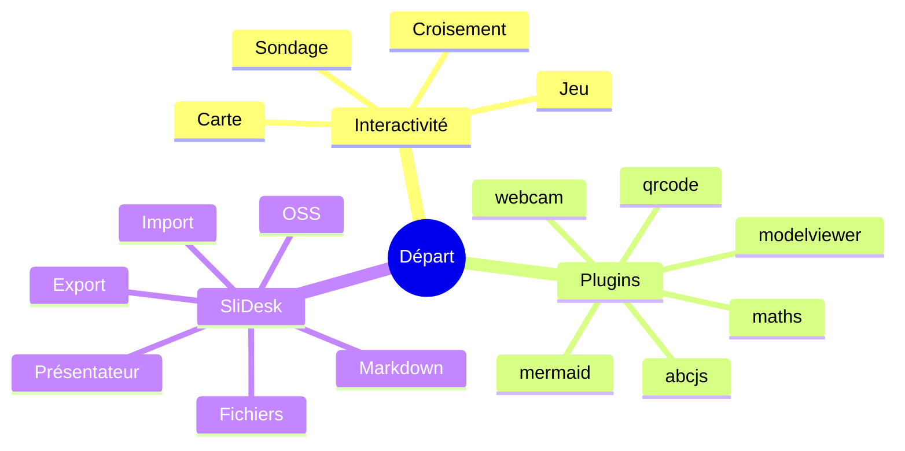
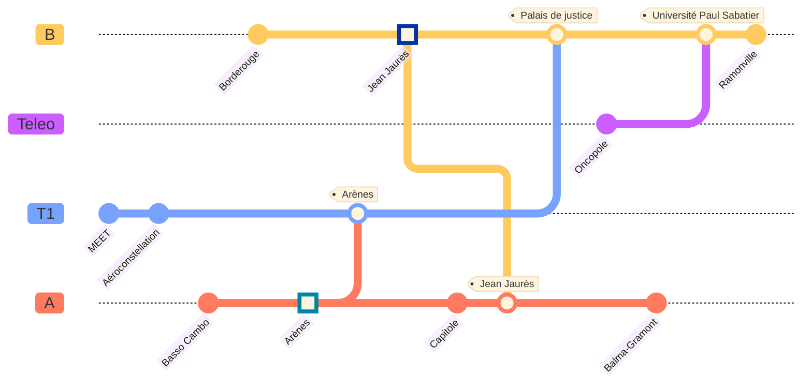

## La panoplie de diagrammes Mermaid .[mermaid-full]
//@ [] 00:45

Le plugin `mermaid` permet de dessiner toutes sortes de diagrammes

```mermaid
mindmap
  root((Départ))
    Interactivité
      Sondage
      ::icon(fa fa-square-poll-vertical)
      Carte
      ::icon(fa fa-map)
      Croisement
      Jeu
      ::icon(fa fa-gamepad)
    Plugins
      qrcode
      maths
      ::icon(fa fa-calculator)
      abcjs
      ::icon(fa fa-music)
      modelviewer
      webcam
      ::icon(fa fa-camera)
      mermaid
    SliDesk
      OSS
      Markdown
      Fichiers
      Présentateur
      Export
      Import
```

```mermaid
---
config:
  logLevel: 'debug'
  theme: 'base'
  gitGraph:
    showBranches: true
    showCommitLabel: true
    mainBranchName: 'B'
---
      gitGraph
        branch Teleo
        branch T1
        branch A
        checkout T1
        commit id:"MEET"
        commit id:"Aéroconstellation"
        checkout A
        commit id:"Basso Cambo"
        checkout B
        commit id:"Borderouge"
        checkout A
        commit type:HIGHLIGHT id:"Arènes"
        checkout T1
        merge A tag:"Arènes"
        checkout B
        commit type:HIGHLIGHT id:"Jean Jaurès"
        checkout A
        commit id:"Capitole"
        merge B tag:"Jean Jaurès"
        checkout B
        merge T1 tag:"Palais de justice"
        checkout Teleo
        commit id:"Oncopole"
        checkout A
        commit id:"Balma-Gramont"
        checkout B
        merge Teleo tag:"Université Paul Sabatier"
        commit id:"Ramonville"
```

